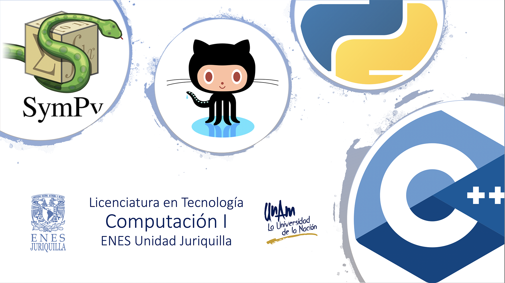

# Licenciatura en Tecnología - Computación I
## Semestre 2021-1

## Profesor
Dr. Ulises Olivares Pinto

### Auxiliar
Walter André Rosales Reyes

## Objetivo
Dotar al estudiante de habilidades básicas de programación y capacidad de abstracción lógica para la solución de problemas utilizando el lenguaje de programación C++ y Python.   

# Prácticas

|Práctica|Temas|Recursos|Fecha de realización|
|--|--|--|--|
|1. Repository|<ol><li>Git</li><li>GitHub</li><li>MarkDown</li></ol>|<ul><li>[Presentación](practicas/1_repository/RepositoryPresentacion.pdf)</li><li>[Práctica](practicas/1_repository)</li></ul>|24/09/20|

#### Última modificación: 24 de septiembre de 2020
